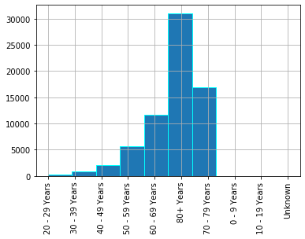

```python
# Load the data into a dataframe
import pandas as pd
df = pd.read_csv("D:/COVID-data-analysis/data/COVID-19_Case_Surveillance_Public_Use_Data.csv")
df
```

    C:\Users\selva\anaconda3\lib\site-packages\IPython\core\interactiveshell.py:3063: DtypeWarning: Columns (4) have mixed types.Specify dtype option on import or set low_memory=False.
      interactivity=interactivity, compiler=compiler, result=result)
    


<div>
<style scoped>
    .dataframe tbody tr th:only-of-type {
        vertical-align: middle;
    }

    .dataframe tbody tr th {
        vertical-align: top;
    }

    .dataframe thead th {
        text-align: right;
    }
</style>
<table border="1" class="dataframe">
  <thead>
    <tr style="text-align: right;">
      <th></th>
      <th>current_status</th>
      <th>cdc_report_dt</th>
      <th>sex</th>
      <th>age_group</th>
      <th>pos_spec_dt</th>
      <th>hosp_yn</th>
      <th>icu_yn</th>
      <th>death_yn</th>
      <th>medcond_yn</th>
      <th>onset_dt</th>
    </tr>
  </thead>
  <tbody>
    <tr>
      <th>0</th>
      <td>Laboratory-confirmed case</td>
      <td>2020/03/16</td>
      <td>Unknown</td>
      <td>10 - 19 Years</td>
      <td>2020/03/13</td>
      <td>No</td>
      <td>Unknown</td>
      <td>Unknown</td>
      <td>No</td>
      <td>NaN</td>
    </tr>
    <tr>
      <th>1</th>
      <td>Laboratory-confirmed case</td>
      <td>2020/03/17</td>
      <td>Male</td>
      <td>10 - 19 Years</td>
      <td>2020/03/13</td>
      <td>Unknown</td>
      <td>Unknown</td>
      <td>Unknown</td>
      <td>Unknown</td>
      <td>NaN</td>
    </tr>
    <tr>
      <th>2</th>
      <td>Laboratory-confirmed case</td>
      <td>2020/03/23</td>
      <td>Male</td>
      <td>10 - 19 Years</td>
      <td>2020/03/13</td>
      <td>No</td>
      <td>No</td>
      <td>No</td>
      <td>No</td>
      <td>2020/03/07</td>
    </tr>
    <tr>
      <th>3</th>
      <td>Laboratory-confirmed case</td>
      <td>2020/03/20</td>
      <td>Male</td>
      <td>10 - 19 Years</td>
      <td>2020/03/13</td>
      <td>No</td>
      <td>Unknown</td>
      <td>Unknown</td>
      <td>Unknown</td>
      <td>2020/03/13</td>
    </tr>
    <tr>
      <th>4</th>
      <td>Laboratory-confirmed case</td>
      <td>2020/03/27</td>
      <td>Male</td>
      <td>10 - 19 Years</td>
      <td>2020/03/13</td>
      <td>No</td>
      <td>No</td>
      <td>No</td>
      <td>No</td>
      <td>2020/03/12</td>
    </tr>
    <tr>
      <th>...</th>
      <td>...</td>
      <td>...</td>
      <td>...</td>
      <td>...</td>
      <td>...</td>
      <td>...</td>
      <td>...</td>
      <td>...</td>
      <td>...</td>
      <td>...</td>
    </tr>
    <tr>
      <th>1111011</th>
      <td>Laboratory-confirmed case</td>
      <td>2020/03/18</td>
      <td>Female</td>
      <td>80+ Years</td>
      <td>2020/03/15</td>
      <td>Yes</td>
      <td>Unknown</td>
      <td>Unknown</td>
      <td>Yes</td>
      <td>NaN</td>
    </tr>
    <tr>
      <th>1111012</th>
      <td>Laboratory-confirmed case</td>
      <td>2020/03/17</td>
      <td>Female</td>
      <td>80+ Years</td>
      <td>2020/03/15</td>
      <td>Unknown</td>
      <td>Unknown</td>
      <td>Unknown</td>
      <td>Unknown</td>
      <td>NaN</td>
    </tr>
    <tr>
      <th>1111013</th>
      <td>Laboratory-confirmed case</td>
      <td>2020/03/30</td>
      <td>Female</td>
      <td>80+ Years</td>
      <td>2020/03/15</td>
      <td>Yes</td>
      <td>Yes</td>
      <td>Yes</td>
      <td>Yes</td>
      <td>2020/03/11</td>
    </tr>
    <tr>
      <th>1111014</th>
      <td>Laboratory-confirmed case</td>
      <td>2020/03/15</td>
      <td>Female</td>
      <td>80+ Years</td>
      <td>2020/03/15</td>
      <td>Yes</td>
      <td>No</td>
      <td>Unknown</td>
      <td>Yes</td>
      <td>2020/03/04</td>
    </tr>
    <tr>
      <th>1111015</th>
      <td>Laboratory-confirmed case</td>
      <td>2020/03/19</td>
      <td>Female</td>
      <td>80+ Years</td>
      <td>2020/03/15</td>
      <td>Yes</td>
      <td>Unknown</td>
      <td>Unknown</td>
      <td>Yes</td>
      <td>NaN</td>
    </tr>
  </tbody>
</table>
<p>1111016 rows × 10 columns</p>
</div>


```python
# Understand the type of each column value
df.info()
```

    <class 'pandas.core.frame.DataFrame'>
    RangeIndex: 1111016 entries, 0 to 1111015
    Data columns (total 10 columns):
     #   Column          Non-Null Count    Dtype 
    ---  ------          --------------    ----- 
     0   current_status  1111016 non-null  object
     1   cdc_report_dt   1111016 non-null  object
     2   sex             1111016 non-null  object
     3   age_group       1111016 non-null  object
     4   pos_spec_dt     582430 non-null   object
     5   hosp_yn         1111016 non-null  object
     6   icu_yn          1111016 non-null  object
     7   death_yn        1111016 non-null  object
     8   medcond_yn      1111016 non-null  object
     9   onset_dt        419597 non-null   object
    dtypes: object(10)
    memory usage: 84.8+ MB
    


```python
# Let us start with data formatting and cleanup of unnecessary data
# Convert non date field to date field
df['cdc_report_dt'] = pd.to_datetime(df['cdc_report_dt'])
df['pos_spec_dt'] = pd.to_datetime(df['pos_spec_dt'])
df['onset_dt'] = pd.to_datetime(df['onset_dt'])
df.info()
```

    <class 'pandas.core.frame.DataFrame'>
    RangeIndex: 1111016 entries, 0 to 1111015
    Data columns (total 10 columns):
     #   Column          Non-Null Count    Dtype         
    ---  ------          --------------    -----         
     0   current_status  1111016 non-null  object        
     1   cdc_report_dt   1111016 non-null  datetime64[ns]
     2   sex             1111016 non-null  object        
     3   age_group       1111016 non-null  object        
     4   pos_spec_dt     582430 non-null   datetime64[ns]
     5   hosp_yn         1111016 non-null  object        
     6   icu_yn          1111016 non-null  object        
     7   death_yn        1111016 non-null  object        
     8   medcond_yn      1111016 non-null  object        
     9   onset_dt        419597 non-null   datetime64[ns]
    dtypes: datetime64[ns](3), object(7)
    memory usage: 84.8+ MB
    


```python
# Check number of NULL values for each column
df.isnull().sum()
# Note that there are many "Unknown" values for columns. We shall keep this for now and filter it later if needed
```


    current_status         0
    cdc_report_dt          0
    sex                    0
    age_group              0
    pos_spec_dt       528586
    hosp_yn                0
    icu_yn                 0
    death_yn               0
    medcond_yn             0
    onset_dt          691419
    dtype: int64


```python
# Let us start with the analysis
# 1. Men/Women in which age group has been most affected ?
# Let us analyze the type of values in age_group column
df.age_group.value_counts()
```


    50 - 59 Years    204764
    40 - 49 Years    184918
    30 - 39 Years    177016
    60 - 69 Years    157546
    20 - 29 Years    145170
    80+ Years         98557
    70 - 79 Years     92590
    10 - 19 Years     35190
    0 - 9 Years       12998
    Unknown            2267
    Name: age_group, dtype: int64


```python
# Try plotting a histogram for age group column
df.age_group.hist(edgecolor = 'cyan',xrot=90)
```


    <matplotlib.axes._subplots.AxesSubplot at 0x29b0d659988>


```python
# 2. Men/Women in which age group has most died due to this disease?
df_died = df[df['death_yn'] == 'Yes']
df_died.age_group.hist(edgecolor = 'cyan',xrot=90)
```


    <matplotlib.axes._subplots.AxesSubplot at 0x29b0decab48>





```python
# 3. Was pre-existing medical conditions increasing the chance of getting affected?
# First, let us understand if those how have pre-existing medical conditions are more
df.medcond_yn.hist(edgecolor = 'cyan',xrot=90)
# Looks like there are more Unknown values. So we cannot arrive at a conclusion at this point
```


    <matplotlib.axes._subplots.AxesSubplot at 0x29b0dec1988>


```python
# As next step, let us see from the patiens who died, what portion have pre-existing medical conditions
df_died.medcond_yn.hist(edgecolor = 'cyan',xrot=90)
# Though there are many unknown values, those with pre-existing medical conditions are more who died
```


    <matplotlib.axes._subplots.AxesSubplot at 0x29b0d3519c8>


```python
# 4. Which age group was the first to know the symptoms?
df.groupby('age_group')['onset_dt'].min()
# As you can see below there is no age group which tops the list. 
# The symptoms started to show from 1st January across various age group
```


    age_group
    0 - 9 Years     2020-02-01
    10 - 19 Years   2020-01-05
    20 - 29 Years   2020-01-01
    30 - 39 Years   2020-01-01
    40 - 49 Years   2020-01-02
    50 - 59 Years   2020-01-01
    60 - 69 Years   2020-01-01
    70 - 79 Years   2020-01-01
    80+ Years       2020-01-01
    Unknown         2020-02-15
    Name: onset_dt, dtype: datetime64[ns]


```python
# How many people who were probable cases died due to not being hospitalized?
df[(df['current_status'] == 'Probable Case') & (df['death_yn'] == 'Yes')].age_group.hist(edgecolor = 'cyan',xrot=90)
# Looks like more people in high age group died than people in lesser age groups
```


    <matplotlib.axes._subplots.AxesSubplot at 0x29b1e84ca48>


```python
# How has the death rate varied as age increases?
# Let us try to create new age group column which is numeric in order to plot this
import numpy as np
df['age_mean'] = df['age_group'].apply(lambda x: x.replace(' Years','').replace('+',''))

# Now let us remove the Unkown values from dataframe as it does not serve to answer our question here
df_age = df[~(df['age_group'] == 'Unknown')]

def calculateMean(ageGroup):
    if(ageGroup == '80'):
        return int((80+100)/2)
    else:
        age_list = ageGroup.split('-')
        age_list = [int(i) for i in age_list]
        return sum(age_list)/len(age_list)
    
df_age['age_mean'] = df_age['age_mean'].apply(lambda x: calculateMean(x))
df_age['age_mean'].value_counts()
```

    C:\Users\selva\anaconda3\lib\site-packages\ipykernel_launcher.py:17: SettingWithCopyWarning: 
    A value is trying to be set on a copy of a slice from a DataFrame.
    Try using .loc[row_indexer,col_indexer] = value instead
    
    See the caveats in the documentation: https://pandas.pydata.org/pandas-docs/stable/user_guide/indexing.html#returning-a-view-versus-a-copy
    


    54.5    204764
    44.5    184918
    34.5    177016
    64.5    157546
    24.5    145170
    90.0     98557
    74.5     92590
    14.5     35190
    4.5      12998
    Name: age_mean, dtype: int64


```python
# Now let us try to plot a graph after grouping based on age_mean
df_age[df_age['death_yn'] == 'Yes'].age_mean.hist(edgecolor = 'cyan',xrot=90)
# As you can see the death rate has increased considerably as age increases
```


    <matplotlib.axes._subplots.AxesSubplot at 0x29b46598c08>


```python
# What is the average time period between various stages (onset of symptom, specimen collection, reporting to CDC) of the disease?
df['Stage 1'] = df['pos_spec_dt'] - df['onset_dt']
df['Stage 2'] = df['cdc_report_dt'] - df['pos_spec_dt']

# Time period between symptom and specimen collection
df['Stage 1'].mean()
```


    Timedelta('5 days 01:22:36.294388')


```python
# Time period between specimen collection and reporting to CDC
df['Stage 2'].mean()
```


    Timedelta('5 days 05:35:34.287038')


```python
# Has the time between onset of symptom and death increased based on age? If so, which age group has the shortest time period to recover from onset of symptom?
# We cannot derive this analysis since we do not have the date of death for patients
```


```python
# What percentage of patients admitted to ICU actually recovered? 
# Does this mean there is more possibility to recover if admitted to ICU?
admitted_and_recovered = df[(df['death_yn'] == 'No') & (df['icu_yn'] == 'Yes')]
admitted_and_died = df[(df['death_yn'] == 'Yes') & (df['icu_yn'] == 'Yes')]
admitted_and_recovered.size
```


    72876


```python
admitted_and_died.size
# There are more who died in ICU than recovered. So there is no assurance that admission to ICU increases recovery rate
```


    132480


```python
# What portion of the patients who were not admitted to ICU died? Could the death rate be decreased if admitted to ICU?
not_admitted_and_recovered = df[(df['death_yn'] == 'No') & (df['icu_yn'] == 'No')].size
not_admitted_and_recovered
```


    855912


```python
not_admitted_and_died = df[(df['death_yn'] == 'Yes') & (df['icu_yn'] == 'No')].size
not_admitted_and_died
# Those who died are less than those who recovered. Again admission to ICU does not guarantee recovery
```


    98820


```python

```
